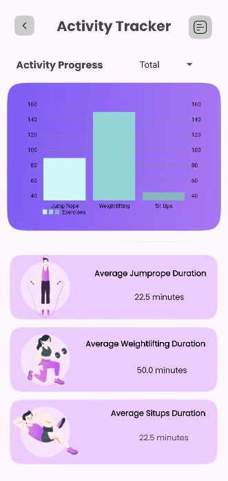

# Move4Wellness Android App

Full Android Application for the Move4Wellness Iniative
Key Features
* Fireside Realtime Database Integration
* Firebase User Authentication Integration
* 14 Unique Pages
* Realtime Charts
* Notifications
* Manager/Admin Functionality:
    * View all users and their past exercises
    * Send global notifications

## Demos

---

### Login & Registration
Using Firebase Authentication and input validation for passwords and emails, users can easily create new accounts or login to existing ones.

---

### User Homepage
When logging in, users can easily add exercises, check their notifications, see their profile, or view the activity tracker.

---

### Activity Tracker & Past Activities
Users can easily view past activities and see important statistics about them, such as a real-time bar chart of the distribution of exercises.

 

---

### Manager/Admin Functionality
Aside from users, manager accounts extends functionalities for Move4Wellness staff, allowing them to view individual exercises and generalized statistics for all users. Additionally, manager accounts are able to send global notifications to all users.

